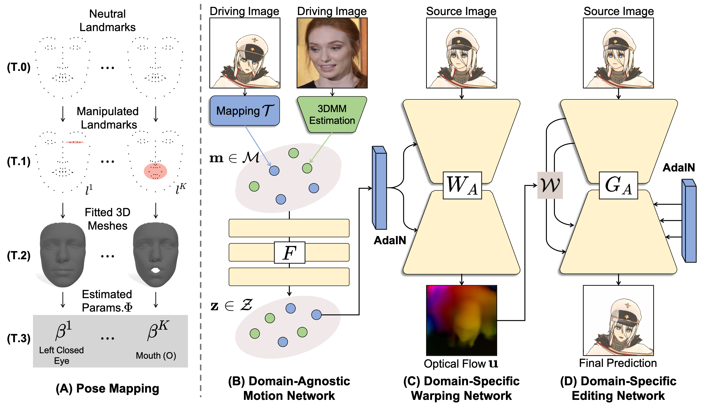

## Animo - Official PyTorch Implementation





## Notice

Our codes contain the baselines (*[First Order Motion Model (FOMM)](https://arxiv.org/abs/2003.00196) and [PIRenderer](https://arxiv.org/abs/2109.08379)*) codes and our proposed method called *Animo*.
We only provide the baselines training with AnimeCeleb dataset and the Animo training with both AnimeCeleb and [VoxCeleb](https://www.robots.ox.ac.uk/~vgg/data/voxceleb/) datasets.


## Installation

Install PyTorch and other dependencies:

```
conda create -y -n [ENV] python=3.8
conda activate [ENV]
pip install -r requirements.txt
```


## Dataset

We train our model using AnimeCeleb and [VoxCeleb](https://arxiv.org/abs/1706.08612). 

### Prepare AnimeCeleb dataset

AnimeCeleb dataset can be downloaded by submiting the [form](https://forms.gle/wN1d6kNZv6sn6ad66).
After downloading, you have to specify a root directory of AnimeCeleb dataset in configuration file (See Training section).  

### Prepare VoxCeleb dataset

1. The dataset is preprocessed following the method used in [FOMM](https://github.com/AliaksandrSiarohin/video-preprocessing). You can follow the instructions in their repository to download and pre-process videos.

2. We extracted 3DMM parameters using [Deep3DFaceReconstruction](https://github.com/microsoft/Deep3DFaceReconstruction). The final folder is with format as:

```
   ${DATASET_ROOT_FOLDER}
   └───images
       └───train
           └───xxx.mp4
                └───0000000.png
                └───0000001.png
                ...
           ...
       └───test
           └───xxx.mp4
                └───0000000.png
                └───0000001.png
                ...
           ...
   └───3dmm
       └───train
           └───xxx.mp4
                └───0000000.mat
                └───0000001.mat
                ...
           ...
       └───test
           └───xxx.mp4
                └───0000000.mat
                └───0000001.mat
                ...
           ...
   ```

## Pre-trained networks

We conduct experiments on the AnimeCeleb and Vox datasets with resolution of 512 x 512. For convenience, we provide our trained network used in our experiments in the following links.

|Animo|[link](https://drive.google.com/file/d/1PYdFbgSioUkSiFDZlAryHHH6CDQGsA5r/view?usp=sharing)|

## Training

Before run the training code, you should change `root_dir` in `./configs/*.yaml` files.

To train First-Order Motion Model (FOMM) with AnimeCeleb dataset:
```
python train.py --config-name=fomm.yaml gpu=[0,1]
```


To train PIRenderer with AnimeCeleb dataset:
```
python train.py --config-name=pirender.yaml gpu=[0,1]
```


Before training Animo, you should download both AnimeCeleb and VoxCeleb datasets and change `root_dir_anime` and `root_dir_vox` in `./configs/animo.yaml` file.

To train Animo with AnimeCeleb and VoxCeleb datasets:
```
python train.py --config-name=animo.yaml gpu=[0,1]
```


The validation results (including tensorboard and model weights) are saved in the `./outputs/` directory.


