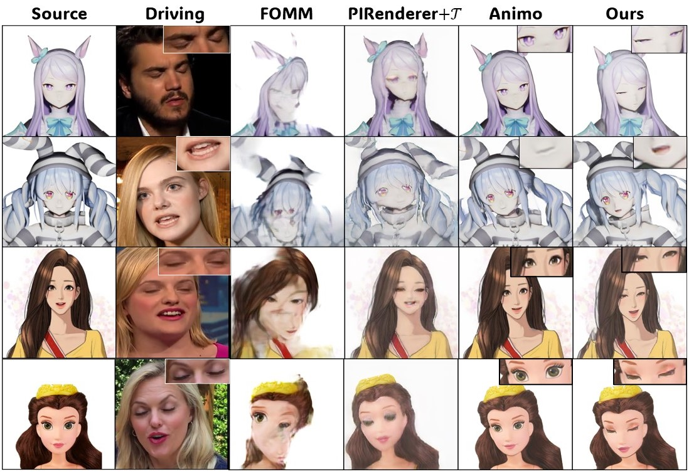
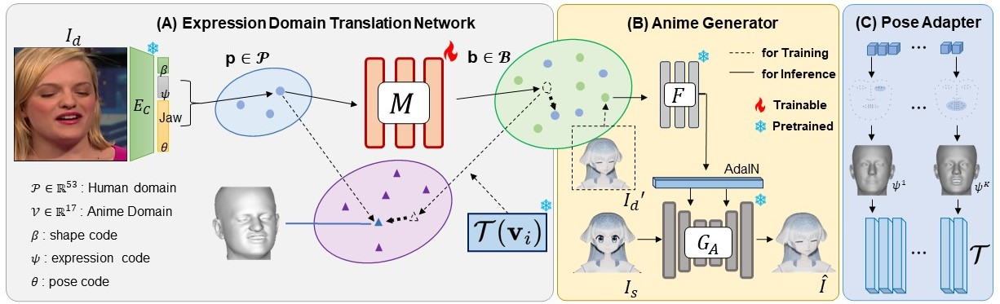

## Expression Domain Translation Network for Cross-domain Head Reenactment

### [Project Page](https://keh0t0.github.io/research/EDTN/) | [Paper](https://arxiv.org/abs/2310.10073)

<!--  -->


### Source | Driving | Animo | EDTN

> **Expression Domain Translation Network for Cross-domain Head Reenactment**<br>
> [Taewoong Kang](https://keh0t0.github.io/)\*<sup>1</sup>, [Jeongsik Oh](https://github.com/JEONGSIKOH0)\*<sup>2</sup>, [Jaeseong Lee](https://leejesse.github.io/)<sup>1</sup>, [Sunghyun Park](https://psh01087.github.io/)<sup>2</sup>, [Jaegul Choo](https://sites.google.com/site/jaegulchoo)<sup>2</sup><br>
> <sup>1</sup>Korea University, <sup>2</sup>KAIST<br>
>
>
> **Abstract:** * Despite the remarkable advancements in head reenactment, the existing methods face challenges in cross-domain head reenactment, which aims to transfer human motions to domains outside the human, including cartoon characters. It is still difficult to extract motion from out-of-domain images due to the distinct appearances, such as large eyes. Recently, previous work introduced a large-scale anime dataset called AnimeCeleb and a cross-domain head reenactment model including an optimization-based mapping function to translate the human domain’s expressions to the anime domain. However, we found that the mapping function, which relies on a subset of expressions, imposes limitations on the mapping of various expressions. To solve this challenge, we introduce a novel expression domain translation network that transforms human expressions into anime expressions. Specifically, to maintain the geometric consistency of expressions between the input and output of the expression domain translation network, we employ a 3D geometric-aware loss function that reduces the distances between the vertices in the 3D mesh of the input and output.  By doing so, it forces high-fidelity and one-to-one mapping with respect to two cross-expression domains. Our method outperforms existing methods in both qualitative and quantitative analysis, marking a significant advancement in the field of cross-domain head reenactment.



## Installation

Since our code includes the DECA Encoder, refer to this [link](https://github.com/yfeng95/DECA.git)
 to complete the environment setup.

In addition, we need the DECA code along with our code.
```
git clone https://github.com/YadiraF/DECA
cd DECA
pip install -r requirements.txt
```
Or use virtual environment by runing
```
git clone https://github.com/YadiraF/DECA
cd DECA
bash install_conda.sh
```
Also, you have to down load the released model as pretrained model from the [link](https://github.com/yfeng95/DECA.git)

## Dataset

We train our model using AnimeCeleb and [VoxCeleb](https://arxiv.org/abs/1706.08612). 

### Prepare AnimeCeleb dataset

AnimeCeleb dataset can be downloaded by submiting the [form](https://forms.gle/wN1d6kNZv6sn6ad66).
After downloading, you have to specify a root directory of AnimeCeleb dataset in configuration file.  

### Prepare VoxCeleb dataset

1. The dataset is preprocessed following the method used in [FOMM](https://github.com/AliaksandrSiarohin/video-preprocessing). You can follow the instructions in their repository to download and pre-process videos.
   
2. For DECA dataset, we have to go through several steps. First, replace `../DECA/decalib/deca.py` with our `deca_edit/deca.py`, and additionally add our `deca_edit/make_dataset_iter.py` to `../DECA/demos`. Then, please edit make_dataset_iter.py with your vox dataset root and run it. 

The final folder is with format as:

```
   ${DATASET_ROOT_FOLDER}
   └───images
       └───train
           └───xxx.mp4
                └───0000000.png
                └───0000001.png
                ...
           ...
       └───test
           └───xxx.mp4
                └───0000000.png
                └───0000001.png
                ...
           ...
   └───deca
       └───train
           └───xxx.mp4
                └───0000000.mat
                └───0000001.mat
                ...
           ...
       └───test
           └───xxx.mp4
                └───0000000.mat
                └───0000001.mat
                ...
           ...
   ```

## Pre-trained networks

We conduct experiments on the AnimeCeleb and Vox datasets with resolution of 512 x 512. For convenience, we provide our trained network used in our experiments in the following links.

|Anime_generator Style|Google Drive|
|--------------|--------------|
|Default|[link](https://drive.google.com/file/d/1jtOmO7Up0cd_d0jiILnRiUw4M6loG00f/view?usp=sharing)|
|Cartoon|[link](https://drive.google.com/file/d/1w1uNknSskDZYDMEfkQAN1lTcmCmT65dl/view?usp=sharing)|

## Training

We need to train the Expression domain translation network (EDTN) and the Anime generator separately.

To train EDTN:
```
python train.py --hyper_id=train_1 gpu=[0]
```

To train Anime generator:
```
python ../Animo/train_AG.py --config-name=Anime_generator.yaml gpu=[0,1]
```

## Inference

Now, after training the two networks, we can create a gif using `infer.py`. Before executing, make sure the paths containing each of the weights are correctly set.

```
python infer.py --path_pose='./example/vox_deca' --anime_basis_path='./example/basis.png'
```

## Citation
If you find this work useful for your research, please cite our paper:

```
@misc{kang2023expression,
      title={Expression Domain Translation Network for Cross-domain Head Reenactment}, 
      author={Taewoong Kang and Jeongsik Oh and Jaeseong Lee and Sunghyun Park and Jaegul Choo},
      year={2023},
      eprint={2310.10073},
      archivePrefix={arXiv},
      primaryClass={cs.CV}
}
```